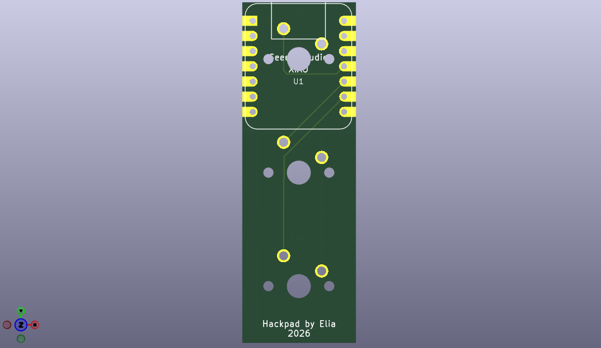
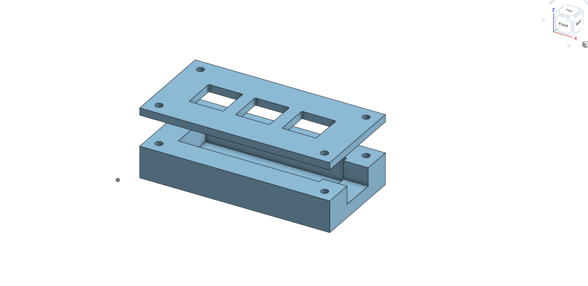
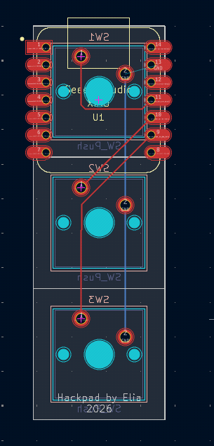

    _   _            _                    _ 
    | | | | __ _  ___| | ___ __   __ _  __| |
    | |_| |/ _` |/ __| |/ / '_ \ / _` |/ _` |
    |  _  | (_| | (__|   <| |_) | (_| | (_| |
    |_| |_|\__,_|\___|_|\_\ .__/ \__,_|\__,_|
                          |_|     

A 3-key macropad, built for Hack Club's Stardance Challenge.

## Gallery
 
| PCB | Final CAD |
| --- | --- |
|  |  |

## What's in this repo
 
- `hackpad.kicad_pro`, `hackpad.kicad_sch`, `hackpad.kicad_pcb` — KiCad project, schematic, and PCB layout
- `enclosure.stl` / `case_lid.stl` — 3D-printable case files
- `hackpad_case.png`
## Building it
 
1. Open `hackpad.kicad_pro` in [KiCad](https://www.kicad.org/) to view or edit the schematic and PCB.
2. Order the PCB from JLCPCB of choice using the KiCad project files.
3. 3D print `enclosure.stl` and `case_lid.stl`.
4. Assemble the PCB into the printed case
 
## What is this?
 
my Hackpad is a tiny 3-switch macro keyboard made of three Cherry MX–compatible switches and an RP2040 microcontroller, running my custom QMK firmware so every key can be remapped to whatever shortcut, media key, or macro you want.
 
## Gallery
 
| PCB (KiCad layout) | PCB (3D render) | Case (final CAD) |
| --- | --- | --- |
|  |  |  |
 

## How it all fits together
 

 
The PCB will fit into the case, with the three switches poking up through the matching cutouts in the lid. The lid then closes over the top with two screws.
 
## Bill of materials
 
| Qty | Part | Notes |
| --- | --- | --- |
| 1 | Seeed Studio XIAO RP2040 (`U1`) | The microcontroller — footprint `XIAO-Generic-Hybrid-14P-2.54-21X17.8MM` |
| 3 | Cherry MX–compatible switches (`SW1`–`SW3`) | Footprint `Button_Switch_Keyboard:SW_Cherry_MX_1.00u_PCB` |
| 1 | Custom PCB | Fabricate from `production/gerbers.zip` |
| 1 | 3D-printed enclosure | `production/enclosure.stl` |
| 1 | 3D-printed lid | `production/case_lid.stl` |
| 4 | Mounting screws |
| 3 | Keycaps (optional) | Any Cherry MX–compatible keycap should fit |
| 1 | USB-C cable |
 
## What's in this repo
 
- `pcb/` — KiCad project, schematic, and PCB layout
- `cad/` — STEP files for the enclosure and lid
- `production/` — ready-to-use files: STLs for printing, gerbers for pcb, and a pre-compiled firmware `.uf2`
- `firmware/` — QMK firmware source and keymap
- `assets/` — fotos and diagrams used in this README
## Building it
 
1. **Get the PCB made** — send `production/gerbers.zip` to a fab, or open `pcb/hackpad.kicad_pro` in [KiCad](https://www.kicad.org/) if you want to modify the design first.
2. **Print the case** — print `production/enclosure.stl` and `production/case_lid.stl` (or the STEP files in `cad/` if you're adapting the shape).
3. **Flash the firmware** — drag `production/simple_hackpad_default.uf2` onto the RP2040 in bootloader mode, or build it yourself from `firmware/` with QMK if you want to change the keymap first.
4. **Assemble** — solder the switches and XIAO to the PCB, drop it into the case, and close up the lid as shown above.

also a big thanks to the Stardance team
